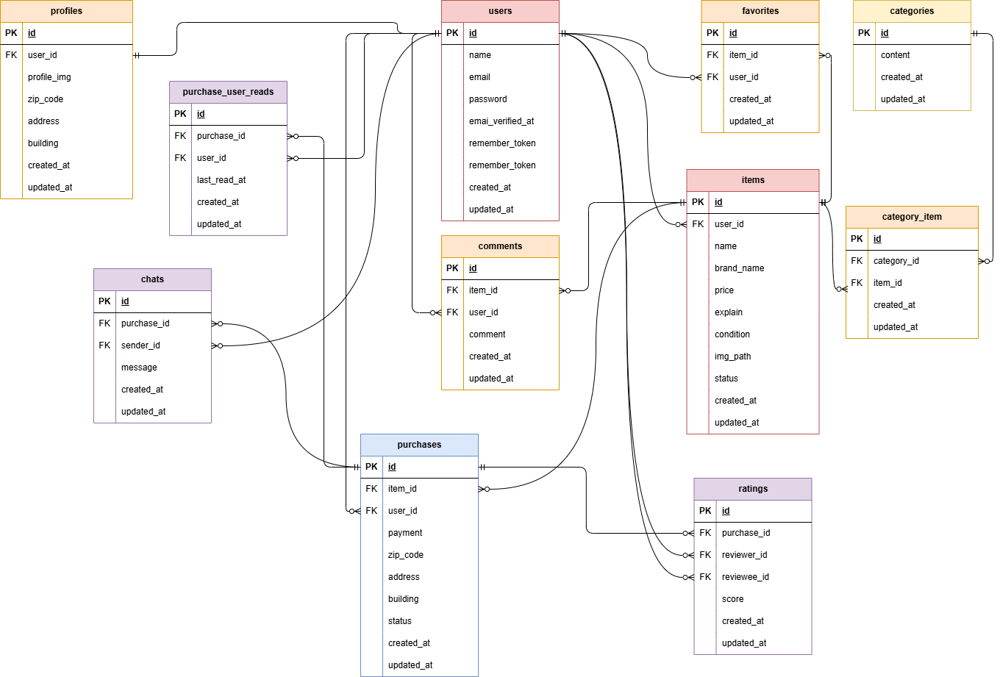

# coachtech フリマ

## 環境構築

### Docker ビルド

以下を実行します

1. ```
   git clone git@github.com:torch29/matsumoto-mogikadai1.git
   ```
2. docker desktop アプリを起動する

3. ```
   docker-compose up -d --build
   ```

### Laravel 環境構築

1. ```
   docker-compose exec php bash
   ```
2. ```
   composer install
   ```
3. `cp .env.example .env` を実行し、.env.example を .env にコピーする。
4. .env ファイルを開き、

   - `DB_HOST=127.0.0.1` を `DB_HOST=mysql` に変更する。
   - DB_DATABASE, DB_USERNAME, DB_PASSWORD を docker-compose.yml と合わせて任意に変更する。  
     （例）
     ```.env
     DB_DATABASE=laravel_db
     DB_USERNAME=laravel_user
     DB_PASSWORD=laravel_pass
     ```

5. ```
   php artisan key:generate
   ```
6. マイグレーションの実行

   ```
   php artisan migrate
   ```

7. シーディングの実行でダミーデータが作られます

   ```
   php artisan db:seed
   ```

8. 下記コマンドにて、シンボリックリンクの生成をお願いします。  
   public 下に storage ディレクトリが作成され参照します。

   ```
   php artisan storage:link
   ```

9. "The stream or file could not be opened"エラーが発生した場合  
   src ディレクトリにある storage ディレクトリに権限を設定

   ```
   chmod -R 777 storage
   ```

### Stripe の設定

Laravel Cashier を用いて Stripe での決済テスト を実装しています。

1. 環境構築の際の`composer install`にて、Laravel Cashier がインストールされます。

2. [Stripe](https://stripe.com/jp) にアクセスし、[今すぐ始める]ボタンから、無料のアカウント登録/サインインをお願いします。（要メールアドレス。）

3. メールアドレス等の必要項目を入力し、アカウントを作成のうえサインインしてください。

4. ページ下部にある「開発者」をクリックし、開いたメニューの中からさらに「API キー」をクリックします。

5. 開いたページに、公開可能キーとシークレットキーが表示されています。

6. `.env` ファイルを開き、確認した公開キーとシークレットキーを以下の欄に設定します。
   ```.env
   STRIPE_KEY=公開可能キー（pk_test_...）
   STRIPE_SECRET=シークレットキー（sk_test_...）
   ```

### MailHog の設定

フリマアプリに会員登録する際にメールアドレス認証が必要となります。  
認証用のメールを確認するメールサーバーとして実装しています。

1. `docker-compose.yml`に、下記が設定されていることを確認します。

   ```yml
   mailhog:
     image: mailhog/mailhog
     ports:
       - "8025:8025"
       - "1025:1025"
     environment:
       MH_STORAGE: memory
   ```

2. もしも 1. の内容を修正した場合は Docker を再ビルドします。（MailHog のイメージをビルド）

   ```
   docker-compose up -d --build
   ```

3. `.env` ファイルを開き以下の項目を設定します。  
   MAIL_FROM_ADDRESS 欄は、適当なもので OK です。
   ```.env
   MAIL_DRIVER=smtp
   MAIL_HOST=mailhog
   MAIL_PORT=1025
   MAIL_USERNAME=
   MAIL_PASSWORD=
   MAIL_ENCRYPTION=
   MAIL_FROM_ADDRESS=mailhog@mailhog.com
   MAIL_FROM_NAME="${APP_NAME}"
   ```
4. http://localhost:8025 にアクセスして、送信されたメールを確認できます。  
   アプリ内では、会員登録後の「メール認証誘導画面」にあるボタンをクリックでも遷移できます。

### テストの準備と実行

PHPUnit によるテストを実行するための設定をします。

1. MySQL コンテナから、テスト用のデータベースを作成します。

   MySQL コンテナに入り root ユーザでログイン（要パスワード入力）

   ```
   docker-compose exec mysql bash
   ```

   ```
   $ mysql -u root -p
   ```

   ログインできたら、test データベースを作成します。（データベース名は任意です。）

   ```.mysql
   > CREATE DATABASE test;
   > SHOW DATABASES;

   ```

2. テスト用に.env ファイルを作成します。

   PHP コンテナに入り、下記を実行して .env をコピーした .env.testing を作成

   ```
   $ cp .env .env.testing
   ```

   `.env.testing` を開き、文頭の `APP_ENV` と `APP_KEY` を編集します。

   ```.env
   APP_NAME=Laravel
   APP_ENV=test
   APP_KEY=
   ```

   さらに、.env.testing にデータベースの接続情報を修正/記述します。

   ```.env
   DB_DATABASE=test
   DB_USERNAME=root
   DB_PASSWORD=root
   ```

3. アプリケーションキーの作成とマイグレーションを実行します

   ```
   $ php artisan key:generate --env=testing
   ```

   ```
   $ php artisan config:clear
   ```

   ```
   $ php artisan migrate --env=testing
   ```

4. テストの実行

   下記コマンドにて、登録されているテストが一括で実行されます

   ```
   $ php artisan test
   ```

## 使用技術

- PHP 7.4.9
- Laravel 8.83.8
- MySQL 8.0.26
- MailHog （会員登録時のメール確認用に使用）
- Stripe（商品購入の決済テストに使用）
- PHPUnit
- JavaScript
- mysql 8.0.26
- nginx 1.21.1

## ER 図

```
ER 図は以下をご参照ください。
```



## 使用方法

- トップページ
  - アドレスは '/' です。出品された商品の全一覧が表示されます。
  - トップページや商品詳細画面の閲覧は、未ログインユーザーでも可能です。
- 商品の出品や購入、コメント・いいね機能の利用には会員登録およびログインが必要です。ログインしていない場合、ログインもしくは登録を促す画面が表示されます。
- 会員登録をすると、以下の機能が利用できます。
  - 自分以外が出品した商品にいいねをつけることができ、トップページのマイリストから確認できます。
  - 商品の出品・購入ができます。
  - マイページから、自身が出品した商品・購入した商品の一覧が確認できます。
  - コメント機能を利用できます。

### シーディング

以下のダミーデータが作成されます。

1. ユーザー

   ```
   テスト　ユーザー： test@example.com（商品id 1～5を出品）
   あいい　うえお： test2@example.com（商品id 6～10を出品）
   かき　くけこ： test3@example.com
   3名共通パスワード：12345678
   ```

- テスト　ユーザーでログインすると、マイページから自身が出品した商品/購入した商品が確認できます。
- 出品した商品「腕時計」には、自然な内容のコメントのやり取りのダミーデータを入れています。それ以外のコメントはランダムです。
- カード決済での購入テストの際は「4242 4242 4242 4242」という番号でテストできます。参照：
  [Stripe - Test Card Numbers](https://docs.stripe.com/testing?locale=ja-JP)

## URL

- フリマアプリのトップページ：http://localhost/
- phpMyAdmin：http://localhost:8080/
- MailHog：http://localhost:8025  
  （会員登録後のボタンクリックからも遷移できます）
