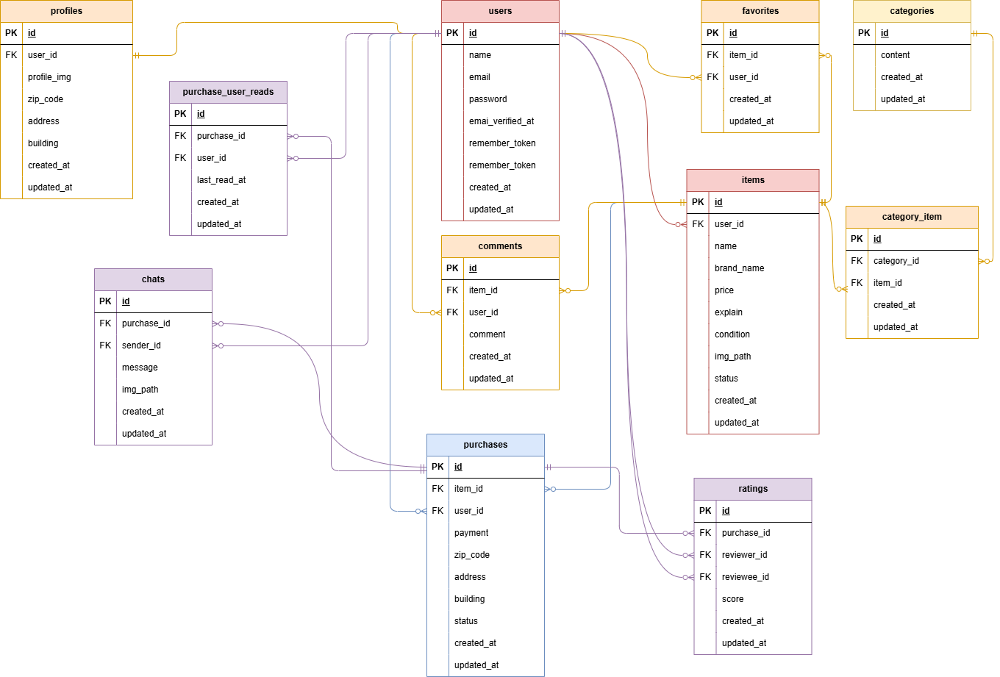

# coachtech フリマ

## 環境構築

### Docker ビルド

以下を実行します

1. `git clone https://github.com/torch29/matasumoto-mogikadai1.git`
2. docker desktop アプリを起動する
3. `docker-compose up -d --build`

### Laravel 環境構築

1. `docker-compose exec php bash`
2. `composer install` を実行
3. `cp .env.example .env` を実行し、.env.example を .env にコピーする。
4. .env ファイルを開き、
   - DB_HOST=127.0.0.1 を DB_HOST=mysql に変更する。
   - DB_DATABASE, DB_USERNAME, DB_PASSWORD を任意に変更する。
     （例）
     ```
     DB_DATABASE=laravel_db
     DB_USERNAME=laravel_user
     DB_PASSWORD=laravel_pass
     ```
5. ```
   php artisan key:generate
   ```
6. マイグレーションの実行

   ```
   php artisan migrate
   ```

7. シーディングの実行でダミーデータが作られます

   ```
   php artisan db:seed
   ```

8. 下記コマンドにて、シンボリックリンクの生成をお願いします。public 下に storage ディレクトリが作成され参照します。

   ```
   php artisan storage:link
   ```

## 使用技術

- PHP 7.4.9
- Laravel 8.83.8
- MySQL 8.0.26
- MailHog （会員登録時のメール認証のメール確認用に使用）
- Stripe（商品購入の決済に使用）
- PHPUnit

## ER 図

```
ER図は以下をご参照ください。
```



## 使用方法

- トップページは、'/' です。出品された商品の全一覧が表示されます。
- トップページや商品詳細画面の閲覧は、未ログインユーザーでも可能です。
- 商品の出品や購入、コメント・いいね機能の利用には会員登録およびログインが必要です。ログインしていない場合、ログインもしくな登録を促す画面が表示されます。
- 会員登録をすると、以下の機能が利用できます。
  - 商品にいいねをつけることができ、トップページのマイリストから確認できます。
  - マイページから、自身が出品した商品・購入した商品の一覧が確認できます。
  - コメント機能を利用できます。
- シーディングにてダミーデータを作成すると、「テスト　ユーザー」という名前でログインすることも可能です。
- テスト　ユーザーでログインすると、マイページから自身が出品した商品/購入した商品が確認できます。
- 出品した商品「腕時計」には、自然な内容のコメントのやり取りのダミーデータを入れています。それ以外のコメントはランダムです。
- テスト ユーザーのログイン情報は以下の通りです。
  - メールアドレス： test@example.com
  - パスワード： 12345678

## URL

- フリマアプリのトップページ：http://localhost/
- phpMyAdmin：http://localhost:8080/
